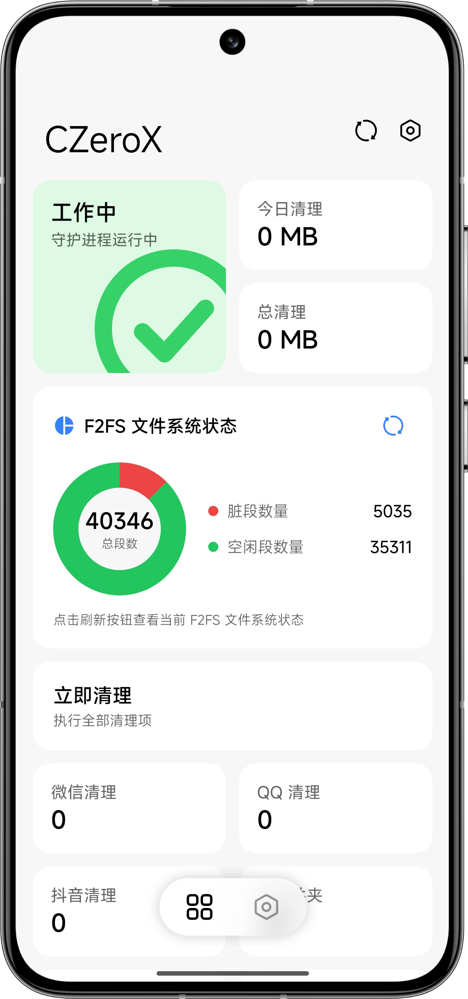

  

<h1 align="center">CZero</h1>

力争做 Android 最好的缓存垃圾清理方案。

  
  
  
  
  

<b>简体中文</b> · <a href="README_en.md">English</a>

---

CZero 是一个 Android Root 清理模块，为常见的高频应用提供缓存清理，并涵盖后台压制、空文件夹清理与 F2FS 垃圾回收等功能。

模块本身无常驻服务，由一个轻量 C++ 守护进程按 `config.json` 调度所有任务，配置修改即时生效。日常修改操作通过原生配套应用 **CZeroX** 完成。

## 文档

> **官方文档  [DOCS](https://czeropage.top/)**
>
> 使用前强烈建议先阅读文档，遇到问题请优先查看 [常见问题](https://czeropage.top/guide/faq)。

## 功能

- **定向缓存清理**——微信 / QQ / 抖音各自独立的清理脚本，按计划触发，并先检测应用是否真的在运行；每个 App 可单独开启增强模式。
- **后台压制**——周期性检测并压制在后台运行的 微信 / QQ / 支付宝，仅保留通知，最大程度减少内存占用。
- **F2FS GC**——监控脏段数量，超阈值时执行垃圾回收。
- **其他清理**——自定义路径清理（`clean_paths.prop`）与空文件夹清扫。
- **配置热重载**——守护进程监视 `config.json`，保存即生效。

## 使用

1. 在 [Releases](https://github.com/Xocio/CZero/releases) 下载最新模块 zip 与 配置应用 apk 。
2. 用 Magisk / KernelSU / APatch 刷入，按音量键提示选择语言、是否继承旧配置。
3. 重启，安装 **CZeroX** 后按需配置。

## CZeroX

配套的原生 Jetpack Compose 应用，界面采用 [Miuix](https://compose-miuix-ui.github.io/miuix/) 风格。

  

## Star History

<a href="https://www.star-history.com/?repos=Xocio%2FCZero&type=timeline&logscale=&legend=top-left">
 <picture>
   <source media="(prefers-color-scheme: dark)" srcset="https://api.star-history.com/chart?repos=Xocio/CZero&type=timeline&theme=dark&logscale&legend=top-left" />
   <source media="(prefers-color-scheme: light)" srcset="https://api.star-history.com/chart?repos=Xocio/CZero&type=timeline&logscale&legend=top-left" />
   
 </picture>
</a>

## 许可证

[Apache License 2.0](LICENSE)
