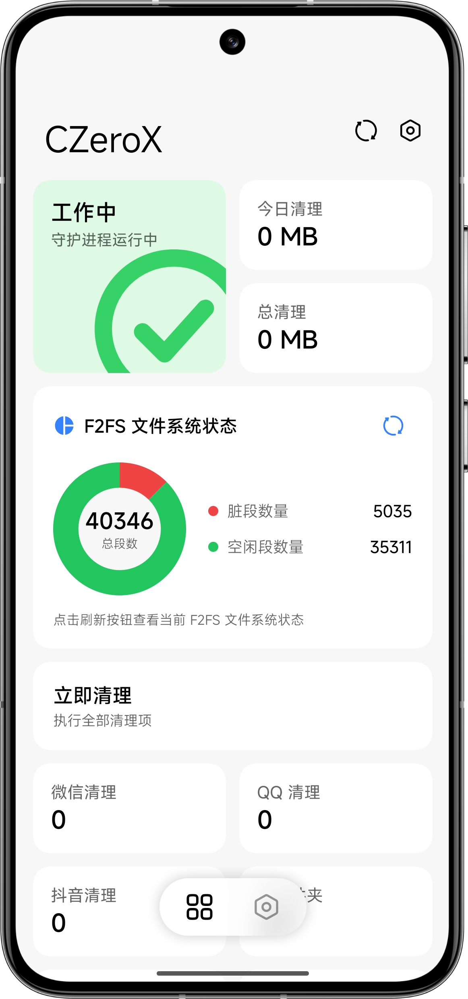

  

<h1 align="center">CZero</h1>

Striving to be the best cache & junk cleaning solution on Android.

  
  
  
  
  

<a href="README.md">简体中文</a> · <b>English</b> · <a href="README_ru.md">Русский</a>

---

CZero is an Android cleaning solution that cleans the cache of frequently used apps, and adds background suppression, fine-grained suppression, empty-folder cleanup, file sorting, F2FS garbage collection and fstrim.

There is no resident service — an extremely lightweight native scheduler triggers every task according to `config.json`, and configuration changes take effect immediately. Day-to-day operation goes through the native companion app **CZeroX**.

## Two editions

| | **Root edition** | **Shizuku edition** |
|---|---|---|
| Authorization | Magisk / KernelSU / APatch | Shizuku |
| Consists of | CZero module + CZeroX (bundled in the module, installed when flashed) | CZero only; the cleaning programs ship with the app |
| Features | Everything | No fine-grained suppression or Storage panel; F2FS reclamation is done by the system's idle maintenance |

Both editions share the same app ID and cannot be installed side by side. See [Choosing an Edition](https://czeropage.top/en/guide/editions) for the full comparison.

## Community

- **Release channel**: [Release](https://t.me/CZeroRelease) — updates and announcements.
- **Chat group**: [Organize](https://t.me/+lwNKCHw_NktjODRh) — feedback and discussion.

## Documentation

> **Official docs [DOCS](https://czeropage.top/en/)**
>
> Reading the docs before use is strongly recommended; if you run into trouble, check the [FAQ](https://czeropage.top/en/guide/faq) first.

## Features

- **Targeted cache cleaning** — dedicated cleaners for WeChat / QQ / Douyin, dual apps included; foreground and game state are checked first, and a minimum interval separates two cleans of the same app.
- **Background suppression** — periodically ends target apps' background subprocesses; the main process and push notifications are unaffected.
- **Fine-grained suppression** (Root edition, BETA) — suspends background apps without killing them, preserving their state for an instant resume, with a built-in effect check.
- **File sorting** — tidies files from download folders and similar locations into category folders by type, with a sorting history and full restore.
- **F2FS GC & fstrim** — run only when the device is genuinely idle, keeping free space and long-term write performance healthy.
- **Custom rules & rule sources** — declare your own cleaning paths and whitelist, or subscribe to third-party rule sources that update daily.
- **Recycle bin** — cleaned files are moved to a recycle bin first, kept 7 days by default and restorable in place.
- **Zero assistant** — scan storage, preview cleanups and manage rules and suppression through conversation; every change requires confirmation.
- **Hot-reload config** — changes apply immediately; a broken config never replaces the last-good job set.

## Download & install

Get the latest release from the [download page](https://czeropage.top/en/download-home) or [Releases](https://github.com/Xocio/CZero/releases).

| File | Description |
|---|---|
| `CZero_<version>.zip` | Root edition module, bundling the Root edition of CZeroX |
| `CZeroX_Root_<version>.apk` | Root edition app; only needed if it was not installed automatically while flashing |
| `CZero_Shizuku_<version>.apk` | Shizuku edition app |

**Root edition**

1. Flash the module zip in Magisk / KernelSU / APatch and use the volume keys to pick a language and whether to inherit your old config.
2. Reboot; CZeroX is installed along with the module.

**Shizuku edition**

1. Install and start [Shizuku](https://shizuku.rikka.app/download/).
2. Install CZeroX (Shizuku edition), open it and grant access when prompted; the app deploys everything by itself.

## CZeroX

<table>
<tr>
<td valign="top" width="50%">

The native Jetpack Compose companion app, styled with [Miuix](https://compose-miuix-ui.github.io/miuix/), available in Simplified Chinese, English and Russian.

</td>
<td align="center" width="50%">

</td>
</tr>
</table>

## Star History

<a href="https://www.star-history.com/?repos=Xocio%2FCZero&type=timeline&logscale=&legend=top-left">
 <picture>
   <source media="(prefers-color-scheme: dark)" srcset="https://api.star-history.com/chart?repos=Xocio/CZero&type=timeline&theme=dark&logscale&legend=top-left&sealed_token=twVK7kU7SjickXCW34YQxO2BJE8Ll27rIB3db1HiNE9oyq1tMAXVJy3TiSVIlrdDuAeF0VGVZEdJTbr2bIBoyyvYERJyDzdmRNbeOOwKSMJZRyid1w3R1pxSIclT5LPro3oFtNGwvcdokYqwmWLAIVDeIo_axyrSqJsR1o8BY-_KOHqAIEWhs6lAn4fa" />
   <source media="(prefers-color-scheme: light)" srcset="https://api.star-history.com/chart?repos=Xocio/CZero&type=timeline&logscale&legend=top-left&sealed_token=twVK7kU7SjickXCW34YQxO2BJE8Ll27rIB3db1HiNE9oyq1tMAXVJy3TiSVIlrdDuAeF0VGVZEdJTbr2bIBoyyvYERJyDzdmRNbeOOwKSMJZRyid1w3R1pxSIclT5LPro3oFtNGwvcdokYqwmWLAIVDeIo_axyrSqJsR1o8BY-_KOHqAIEWhs6lAn4fa" />
   
 </picture>
</a>

## License

[GNU General Public License v3.0](LICENSE)
